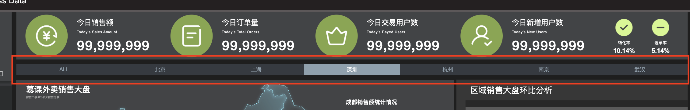

# 数据可视化 - 数据大屏

> 本项目为数据可视化之数据大屏，技术栈使用 Vue3.0 + Echarts，具体详见：[课程官网](http://www.youbaobao.xyz/datav-docs/) + [个人笔记](https://github.com/MrEnvision/data-vision-screen)。
>
> TIP：更多内容详见[数据可视化专题](https://github.com/MrEnvision/data-vision)！！！


## 0. 预览


本项目需要配合[数据可视化-组件库](https://github.com/MrEnvision/data-vision-libs)使用，请先安装组件库：

```shell
$ git clone https://github.com/MrEnvision/data-vision-libs.git
```

然后在clone下来的组件库文件里创建link：

```shell
$ npm link
```

最后在本项目中依赖组件库，使得本地调试可以直接运用组件库内容：

```shell
$ npm link data-vision-libs
```

运行本项目：

```shell
$ npm i
$ npm run serve
```


## 1. 开发

### 1.1 切换目录组件



- 鼠标移入高亮通过两个事件来监听处理：onmouseenter 和 onmouseleave；

- 高亮自动切换通过一个number来处理，通过增添一个判断index是否等于number即可；

> mouseover ,mouseout ,mouseenter,mouseleave的区别？ 具体详见：[JS事件](https://github.com/MrEnvision/Front-end_learning_notes/blob/master/javascript/topics/event.md)

### 1.2 自动轮播列表组件*


>本组件开发具有一定难度，逻辑较为复杂，具体详见[源代码](./src/components/BasicScroll/index.vue).

- 在修改和使用父组件的值（例如props）的时候，不要直接使用使得污染这个值，要采用深拷贝重新赋值，对此来进行处理，深拷贝有很多种方法，例如`target=JSON.parse(JSON.stringify(source))`等，本项目采用[Lodash库](https://www.lodashjs.com)中的`cloneDeep`完成深拷贝。
- 踩坑点：对于v-for循环的数组数据在不断变化的情况下，key值不能简单使用索引号来区分，不然会乱套的！
- 程序中断几秒再继续往下执行可以通过sleep函数实现：

```js
const sleep = () => {
  return new Promise(resolve => setTimeout(resolve, 1000))
}
await sleep()
```


------

如果发现本项目有错误，欢迎提交 issues 指正，也可联系邮箱[EnvisionShen@gmail.com](mailto:EnvisionShen@gmail.com)。